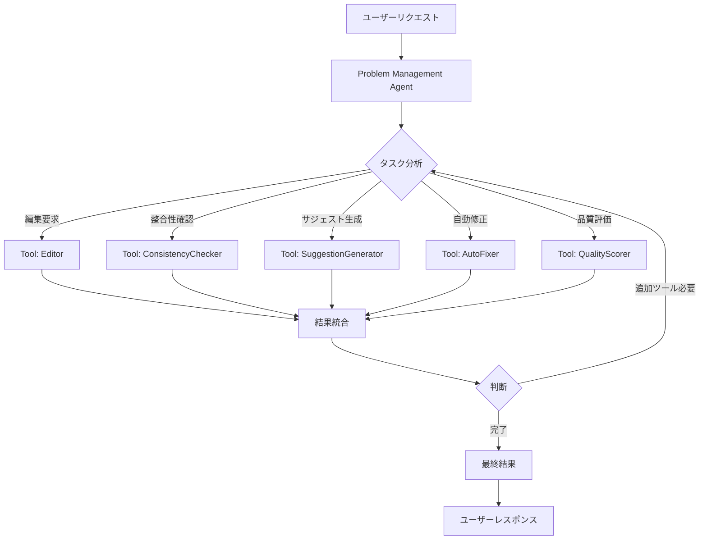

# AI Agent ワークフロー仕様書

## 概要

テスト問題生成・編集システムにおいて、問題の各要素（問題文、選択肢、解説）の整合性を保ちながら、AIによる動的なサジェスト生成と編集を実現する。

## 現在の実装状況

### 基本機能
1. **問題生成** - OpenAI APIを使用した10問セット生成（選択7問、記述3問）
2. **個別編集** - 問題文、選択肢、解説を個別に修正可能
3. **PDF出力** - 生成した問題をPDF化（問題用紙・解答用紙）

### 課題
- 問題文を編集した際、選択肢や解説との整合性が崩れる可能性
- サジェストが固定文言で、問題内容に応じた提案ができない
- 編集操作が独立しており、相互の関連性が考慮されていない

## 新要件

### 1. 動的サジェスト生成
問題の内容に応じてAIが適切な改善提案を生成する。

#### API設計
```
GET /api/suggestions/:problemId
Response: {
  prompt: ["提案1", "提案2", "提案3", "提案4"],
  choices: ["提案1", "提案2", "提案3", "提案4"],  // MCQのみ
  explanation: ["提案1", "提案2", "提案3", "提案4"]
}
```

#### サジェスト生成ロジック
- 問題の教科・難易度・内容を分析
- 各セクションに対して4つの具体的な改善提案を生成
- 15文字以内の簡潔な提案文

### 2. 整合性チェック機能

#### 実装すべきチェック項目

##### 問題文編集時
- 選択肢が問題文の要求に合致しているか
- 正解選択肢が依然として正しいか
- 解説が新しい問題文に対応しているか

##### 選択肢編集時
- 正解選択肢が含まれているか
- ダミー選択肢が適切な難易度か
- 解説が選択肢の内容を正しく説明しているか

##### 解説編集時
- 問題文と答えに対して論理的に正しいか
- 必要な情報が含まれているか

### 3. シングルエージェント + ツール アーキテクチャ

#### 設計思想
単一の賢いエージェント（Problem Management Agent）が、複数の専門ツールを使い分けて問題編集タスクを遂行する。エージェントは状況を判断し、適切なツールを選択・組み合わせて最適な結果を導く。

#### エージェントワークフロー



#### シングルエージェント: Problem Management Agent

**役割**: 問題編集に関するすべてのタスクを統括し、適切なツールを選択・実行して最適な結果を提供する

**判断能力**:
- ユーザーの意図を理解
- 必要なツールの選定
- ツール実行順序の決定
- 結果の評価と追加アクションの判断
- エラーハンドリングとフォールバック

#### 利用可能なツール

##### 1. Editor Tool
```typescript
interface EditorTool {
  edit(problemId: string, field: 'prompt' | 'choices' | 'explanation', instruction: string): Promise<{
    original: any;
    edited: any;
    changes: string[];
  }>;
}
```
**責務**: 指定されたフィールドをAIで編集

##### 2. ConsistencyChecker Tool
```typescript
interface ConsistencyCheckerTool {
  check(problem: Problem): Promise<{
    isConsistent: boolean;
    issues: Issue[];
    score: number;
  }>;
}
```
**責務**: 問題の論理的整合性をチェック

##### 3. SuggestionGenerator Tool
```typescript
interface SuggestionGeneratorTool {
  generate(problem: Problem, context?: EditHistory): Promise<{
    prompt: string[];
    choices?: string[];
    explanation: string[];
  }>;
}
```
**責務**: コンテキストに応じた改善提案を生成

##### 4. AutoFixer Tool
```typescript
interface AutoFixerTool {
  fix(problem: Problem, issues: Issue[]): Promise<{
    fixes: Partial<Problem>;
    confidence: number;
  }>;
}
```
**責務**: 検出された問題を自動修正

##### 5. QualityScorer Tool
```typescript
interface QualityScorerTool {
  evaluate(problem: Problem): Promise<{
    overallScore: number;
    metrics: {
      clarity: number;
      difficulty: number;
      educationalValue: number;
      consistency: number;
    };
  }>;
}
```
**責務**: 問題の品質を多角的に評価

#### エージェントの判断フロー

```typescript
class ProblemManagementAgent {
  async process(request: UserRequest): Promise<AgentResponse> {
    // 1. リクエスト分析
    const intent = this.analyzeIntent(request);

    // 2. 初期ツール選択
    const tools = this.selectTools(intent);

    // 3. ツール実行ループ
    let results = [];
    let currentState = await this.getCurrentState(request.problemId);

    for (const tool of tools) {
      const result = await this.executeTool(tool, currentState);
      results.push(result);

      // 4. 中間判断
      if (this.needsAdditionalAction(result)) {
        const additionalTools = this.determineAdditionalTools(result);
        tools.push(...additionalTools);
      }

      // 5. 状態更新
      currentState = this.updateState(currentState, result);
    }

    // 6. 最終判断と結果生成
    return this.generateResponse(results, currentState);
  }

  private analyzeIntent(request: UserRequest): Intent {
    // ユーザーの意図を分析
    // 例: "もっと簡単に" → Intent.SIMPLIFY
    // 例: "整合性チェック" → Intent.CHECK_CONSISTENCY
  }

  private selectTools(intent: Intent): Tool[] {
    // 意図に基づいて初期ツールセットを選択
    switch(intent) {
      case Intent.EDIT_WITH_CHECK:
        return [Editor, ConsistencyChecker, QualityScorer];
      case Intent.SUGGEST_IMPROVEMENTS:
        return [SuggestionGenerator, QualityScorer];
      case Intent.FIX_ISSUES:
        return [ConsistencyChecker, AutoFixer, QualityScorer];
    }
  }

  private needsAdditionalAction(result: ToolResult): boolean {
    // 結果を評価して追加アクションが必要か判断
    if (result.type === 'consistency' && !result.isConsistent) {
      return true; // 不整合があれば修正ツールが必要
    }
    if (result.type === 'quality' && result.score < 0.7) {
      return true; // 品質が低ければ改善ツールが必要
    }
    return false;
  }
}
```

#### 実行例

**ケース1: 問題文を編集して整合性を保つ**
```
1. ユーザー: "問題文をもっと具体的にして"
2. エージェント判断:
   - Editor Tool で問題文を編集
   - ConsistencyChecker Tool で整合性チェック
   - 不整合があれば AutoFixer Tool で選択肢・解説を調整
   - QualityScorer Tool で最終品質確認
3. レスポンス: 編集済み問題 + 整合性レポート + 品質スコア
```

**ケース2: 総合的な問題改善**
```
1. ユーザー: "この問題を改善して"
2. エージェント判断:
   - QualityScorer Tool で現状評価
   - SuggestionGenerator Tool で改善提案生成
   - Editor Tool で低スコア項目を改善
   - ConsistencyChecker Tool で整合性確認
   - QualityScorer Tool で改善後評価
3. レスポンス: 改善前後の比較 + 実施した改善内容
```

## 実装計画

### Phase 1: 動的サジェスト（実装済み）
- [x] `/api/suggestions/:problemId` エンドポイント追加
- [ ] フロントエンドでの動的取得・表示
- [ ] ローディング状態の管理

### Phase 2: 整合性チェック
- [ ] 整合性チェックAPIエンドポイント追加
- [ ] チェックロジックの実装（workflows/consistency.ts）
- [ ] 不整合時の警告UI

### Phase 3: 自動修正提案
- [ ] 自動修正APIエンドポイント追加
- [ ] 修正提案の生成ロジック
- [ ] 承認/拒否のUI実装

### Phase 4: Agent統合
- [ ] Agent間の連携フロー実装
- [ ] トランザクション管理
- [ ] エラーハンドリング強化

## API仕様詳細

### 整合性チェックAPI
```typescript
POST /api/problems/:id/check-consistency
Request: {
  updatedField: 'prompt' | 'choices' | 'explanation',
  newValue: string | string[]
}
Response: {
  isConsistent: boolean,
  issues: Array<{
    field: string,
    issue: string,
    suggestion: string
  }>,
  autoFixAvailable: boolean
}
```

### 自動修正API
```typescript
POST /api/problems/:id/auto-fix
Request: {
  issues: Array<{field: string, issue: string}>
}
Response: {
  fixes: {
    choices?: string[],
    explanation?: string,
    prompt?: string
  },
  confidence: number  // 0-1の信頼度スコア
}
```

### バッチ整合性チェック
```typescript
POST /api/worksheets/:id/validate
Response: {
  problems: Array<{
    id: string,
    isValid: boolean,
    issues: string[]
  }>,
  overallScore: number
}
```

## UI/UX設計

### 整合性インジケーター
- 各問題カードに整合性ステータスアイコン表示
  - ✅ 緑：整合性OK
  - ⚠️ 黄：軽微な問題
  - ❌ 赤：重大な不整合

### 編集フロー
1. ユーザーが編集ボタンをクリック
2. AIサジェストが自動表示
3. 編集実行後、整合性チェック自動実行
4. 不整合の場合、修正提案を表示
5. ワンクリックで自動修正を適用可能

### プログレッシブエンハンスメント
- 基本機能は現状維持
- 整合性チェックは追加機能として段階的に有効化
- エラー時は従来の動作にフォールバック

## 技術的考慮事項

### パフォーマンス
- サジェスト生成は非同期・遅延読み込み
- 整合性チェックはデバウンス処理
- キャッシュ戦略（Redis検討）

### コスト最適化
- OpenAI API呼び出しの最小化
- バッチ処理の活用
- 軽微な修正は規則ベースで処理

### エラーハンドリング
- API障害時のグレースフルデグラデーション
- 部分的な機能停止でも基本編集は継続可能
- ユーザーへの適切なフィードバック

## 今後の拡張可能性

### 学習機能
- 編集履歴からユーザーの好みを学習
- よく使われるサジェストの優先表示

### 協調編集
- 複数教員での問題レビュー機能
- コメント・承認フロー

### 品質メトリクス
- 問題の品質スコアリング
- 難易度の自動判定精度向上

## まとめ

本仕様は、AI Agentパターンを活用した高度な問題編集システムの実現を目指す。段階的な実装により、リスクを最小化しながら価値を継続的に提供する。